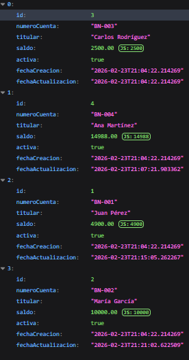
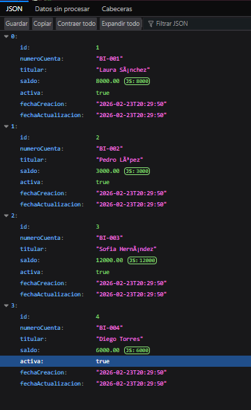
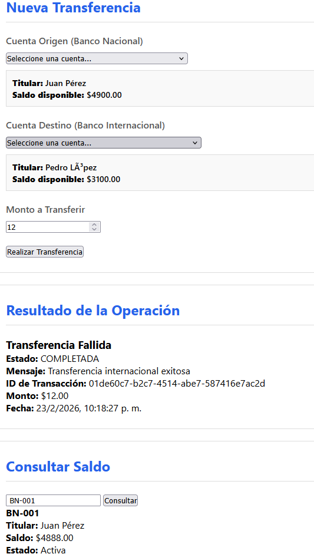
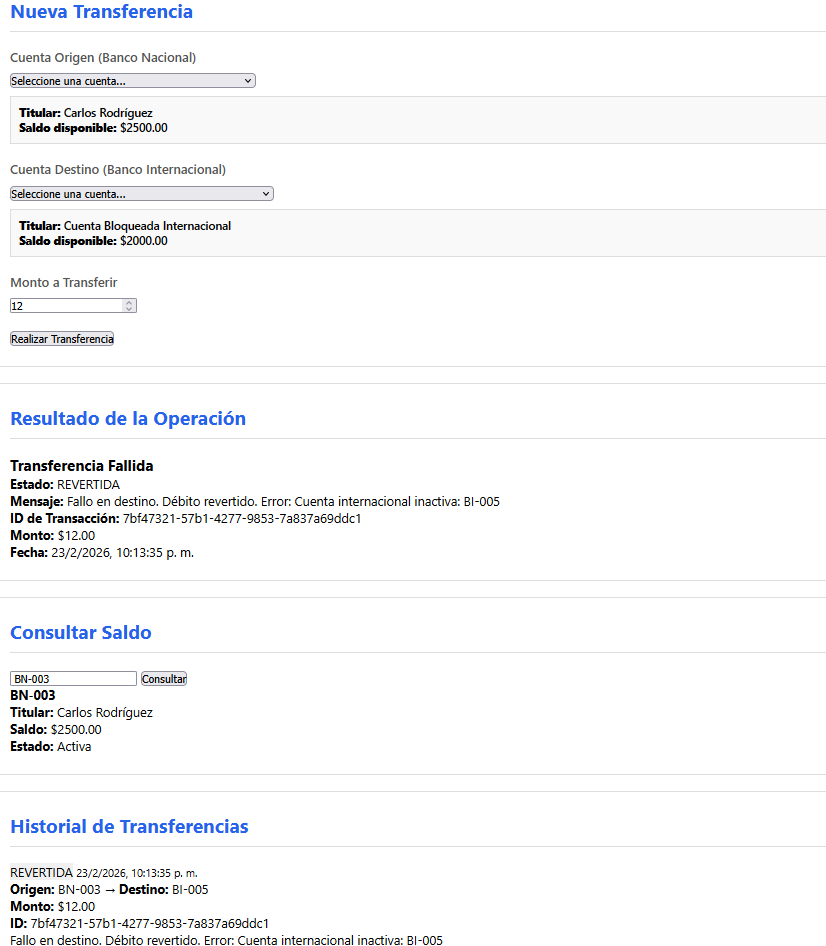

Con ese link comprobé que la info del internacional estuviera bien, con la del nacional aun hay algo raro con la base de datos :) -> http://localhost:8080/api/cuentas/internacionalCon ese link comprobé que la info del internacional estuviera bien, con la del nacional aun hay algo raro con la base de datos :) -> http://localhost:8080/api/cuentas/internacional

# Sistema de Transferencias Interbancarias Distribuidas
## Materia: Arquitectura de Software
## Pontificia Universidad Javeriana

## Integrantes del Equipo

- Juan Diego Muñoz Angulo
- Andres Felipe Torres Monroy
- David Roa Neisa
- Juan David Garrido Ramos
---

## Instrucciones de Instalación

### Requisitos Previos
- Docker Desktop instalado y en ejecución
- Java 17 o superior
- Maven 3.6 o superior
- Git

### Pasos para la Instalación

1. Clonar el repositorio:
```bash
git clone https://github.com/JuanDGarridoR/Taller-1-AS.git
cd Taller-1-AS
```

2. Verificar que Docker Desktop esté corriendo:
```bash
docker --version
docker-compose --version
```

3. Construir y levantar todos los servicios:
```bash
docker-compose up -d --build
```

Este comando realizará las siguientes acciones:
- Construye la imagen de la aplicación Spring Boot
- Descarga las imágenes de PostgreSQL 15 y MySQL 8
- Crea las redes y volúmenes necesarios
- Inicia las bases de datos con los datos de prueba
- Desplega la aplicación en el puerto 8080


### Comandos Útiles

Detener todos los servicios:
```bash
docker-compose down
```

Ver logs de la aplicación:
```bash
docker-compose logs -f app
```

Reiniciar desde cero eliminando los datos:
```bash
docker-compose down -v
docker-compose up -d --build
```

---

## Descripción de la Arquitectura

### Componentes del Sistema

El sistema está compuesto por cuatro capas principales que trabajan en conjunto para implementar transacciones distribuidas entre dos bancos con motores de base de datos diferentes:

**1. Capa de Presentación**
- Frontend web estático (HTML/JavaScript/CSS)
- Interfaz de usuario para realizar transferencias y consultar saldos
- Comunicación con el backend mediante API REST

**2. Capa de Aplicación (Spring Boot)**
- API REST que expone endpoints para transferencias y consultas
- Orquestador del patrón SAGA para coordinar transacciones distribuidas
- Servicios de negocio para cada banco (BancoNacionalService, BancoInternacionalService)
- Servicio de transferencias que implementa la lógica de compensación

**3. Capa de Persistencia**
- Configuración dual de DataSources (PostgreSQL y MySQL)
- Repositorios JPA separados para cada base de datos
- Entity Managers independientes para cada fuente de datos
- Gestores de transacciones específicos para cada banco

**4. Capa de Datos**
- Base de datos PostgreSQL 15 para el Banco Nacional
- Base de datos MySQL 8 para el Banco Internacional
- Esquemas idénticos pero con sintaxis adaptada a cada motor
- Datos de prueba precargados en ambas bases de datos

### Flujo de Comunicación

```
[Frontend] → POST /api/transferencias
                 ↓
        [TransferenciaService]  ← Orquestador SAGA
         |        ↓ persiste estado
         |   [tabla transferencia] (PostgreSQL)
         |
         ├─ PASO 1: BancoNacionalService.debitar()
         |          ↓ PostgreSQL (PESSIMISTIC_WRITE lock)
         |   [tabla cuenta + movimiento]
         |
         └─ PASO 2: BancoInternacionalService.acreditar()
                    ↓ MySQL (PESSIMISTIC_WRITE lock)
            [tabla cuenta + movimiento]
```

### Patrón SAGA Implementado

El sistema utiliza el patrón SAGA Orquestado para mantener la consistencia entre las dos bases de datos heterogéneas. El flujo de una transferencia exitosa es:

1. Crear registro de transferencia con estado INICIADA
2. Debitar monto en cuenta origen (Banco Nacional - PostgreSQL)
3. Si el débito es exitoso, actualizar estado a DEBITO_COMPLETADO
4. Acreditar monto en cuenta destino (Banco Internacional - MySQL)
5. Si el crédito es exitoso, actualizar estado a COMPLETADA

En caso de fallo durante la acreditación, se ejecuta la transacción compensatoria:
- Revertir el débito devolviendo el dinero a la cuenta origen
- Marcar la transferencia como REVERTIDA

Estados del SAGA:
```
INICIADA → DEBITO_COMPLETADO → COMPLETADA          (camino exitoso)
INICIADA → FALLIDA                                 (débito falló, sin cambios)
DEBITO_COMPLETADO → COMPENSANDO → REVERTIDA        (crédito falló, débito revertido)
```

---

## Decisiones de Diseño

### 1. Patrón SAGA Orquestado en lugar de XA/2PC
PostgreSQL y MySQL tienen implementaciones de XA incompatibles e incompletas. XA requiere además un transaction manager externo (Atomikos, Bitronix) con alto overhead de latencia. El patrón SAGA resuelve esto con transacciones locales independientes y transacciones compensatorias, priorizando disponibilidad sobre consistencia fuerte (teorema CAP).

### 2. Log durable del SAGA en PostgreSQL
El estado de cada SAGA se persiste en la tabla `transferencia` **antes** de mover dinero. Esto garantiza que si la JVM muere entre el débito y el crédito, el estado queda registrado en BD y puede recuperarse manualmente. Sin esto, el dinero podría perderse sin trazas.

### 3. Locks pesimistas (PESSIMISTIC_WRITE)
Ambos repositorios usan `@Lock(LockModeType.PESSIMISTIC_WRITE)` en `findByNumeroCuenta()`. Esto previene condiciones de carrera cuando dos transferencias intentan debitar la misma cuenta simultáneamente: la segunda espera a que la primera confirme o revierta antes de proceder.

### 4. Repositorios separados por base de datos
Cada banco tiene su propio paquete de repositorios vinculado a su `EntityManagerFactory` y `TransactionManager`. Esto evita que Spring JPA mezcle contextos de persistencia entre PostgreSQL y MySQL, problema que causa errores difíciles de diagnosticar.

### 5. Audit trail con tabla Movimiento
Cada operación (débito, crédito, compensación) registra un `Movimiento` con saldo anterior y nuevo. Esto proporciona un historial inmutable de cada paso, requerido para auditorías y para verificar la consistencia del sistema en producción.

## Capturas de Pantalla de Pruebas

### Prueba 1: Consulta de Cuentas Nacionales

Endpoint: `GET /api/cuentas/nacional`

Se consultan las cuentas del Banco Nacional almacenadas en **PostgreSQL**. El frontend las muestra en la pestaña "Banco Nacional" con número de cuenta, titular, saldo actual y estado. Confirma que el DataSource primario (PostgreSQL) está operativo y retorna datos correctamente.



---

### Prueba 2: Consulta de Cuentas Internacionales

Endpoint: `GET /api/cuentas/internacional`

Se consultan las cuentas del Banco Internacional almacenadas en **MySQL**. La pestaña "Banco Internacional" confirma que el segundo DataSource está operativo e independiente del primero. Demuestra que la configuración dual de `EntityManagerFactory` funciona correctamente, cada banco consultando su propia base de datos.



---

### Prueba 3: Transferencia Exitosa — SAGA Happy Path

Endpoint: `POST /api/transferencias`
Datos: `BN-004 → BI-003, $12.00`

El orquestador SAGA ejecuta los dos pasos correctamente:
1. **PASO 1:** Débito en Banco Nacional (PostgreSQL) — estado persiste como `DEBITO_COMPLETADO`
2. **PASO 2:** Crédito en Banco Internacional (MySQL) — estado persiste como `COMPLETADA`

El resultado muestra estado **COMPLETADA** con el UUID de transacción generado por el orquestador. Los saldos quedan actualizados: `BN-004` $15000 → $14988 y `BI-003` $12000 → $12012. La sección "Historial de Transferencias" del frontend y "Consultar Saldo" confirman la consistencia en ambas bases de datos.



---

### Prueba 4: Transferencia a Cuenta Inactiva — SAGA con Compensación

Endpoint: `POST /api/transferencias`
Datos: cuenta origen activa → `BI-005` (cuenta bloqueada, `activa = false`)

Esta prueba valida el mecanismo de compensación del SAGA:
1. **PASO 1:** Débito ejecutado exitosamente en Banco Nacional (PostgreSQL)
2. **PASO 2:** Falla al intentar acreditar — la cuenta destino está inactiva
3. **COMPENSACIÓN:** El orquestador detecta el fallo, revierte el débito devolviendo el dinero a la cuenta origen
4. Estado final: **REVERTIDA** — el saldo de la cuenta origen queda intacto

Esto demuestra que el patrón SAGA garantiza que no quede dinero "perdido" entre bases de datos ante cualquier fallo en el paso de acreditación.



---

## Reflexión Personal

Durante el desarrollo de este proyecto, tuvimos la oportunidad de enfrentarnos a uno de los problemas más complejos en sistemas distribuidos: mantener la consistencia de datos entre múltiples bases de datos heterogéneas. La implementación del patrón SAGA nos permitió comprender de manera práctica las dificultades que surgen cuando no se pueden usar transacciones ACID tradicionales.

Lo más desafiante fue entender que en sistemas distribuidos no existe una forma perfecta de garantizar consistencia sin sacrificar algo. El patrón SAGA ofrece consistencia eventual, lo que significa que durante breves momentos el sistema puede estar en un estado inconsistente hasta que se ejecuten las compensaciones necesarias. Este concepto inicial fue difícil de aceptar viniendo de la comodidad de las transacciones tradicionales de una sola base de datos.

La configuración de múltiples datasources en Spring Boot resultó más compleja de lo esperado. Cada base de datos requiere su propio EntityManager, TransactionManager y configuración de repositorios. Aprendimos que los detalles importan: pequeñas diferencias como el uso de @Primary o la correcta configuración de los paquetes de los repositorios pueden hacer que toda la aplicación falle de formas difíciles de debuggear.

El debugging de transacciones distribuidas nos enseñó el valor del logging detallado. Sin buenos logs, es casi imposible entender qué está sucediendo cuando una transferencia falla. Ver el flujo completo del SAGA en los logs nos ayudó a identificar problemas y a ganar confianza en que el sistema funciona correctamente.

Una lección importante fue comprender el teorema CAP en la práctica. No podemos tener consistencia fuerte, disponibilidad total y tolerancia a particiones al mismo tiempo. Al elegir el patrón SAGA, estamos priorizando disponibilidad sobre consistencia fuerte, lo cual tiene sentido en muchos escenarios del mundo real.

Finalmente, este proyecto nos mostró que las arquitecturas distribuidas requieren un nivel de pensamiento y diseño mucho más cuidadoso que las aplicaciones monolíticas. Cada decisión de diseño tiene trade-offs, y es responsabilidad del desarrollador entender estas implicaciones y elegir el enfoque más adecuado para cada caso de uso específico.
